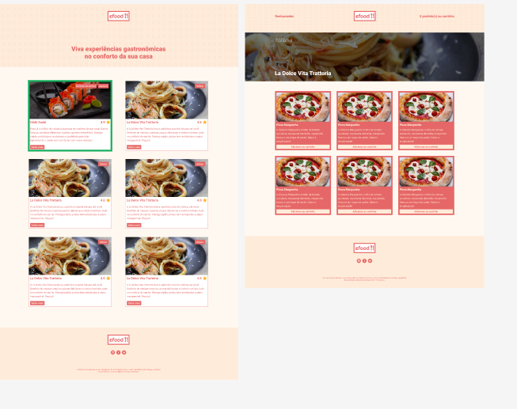
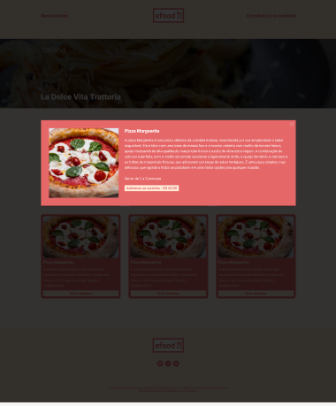

<!DOCTYPE html>
<html lang="pt-br">
<head>
    <meta charset="UTF-8">
    <meta name="viewport" content="width=device-width, initial-scale=1.0">
    <meta name="description" content="Clone eFood">
    <meta name="keywords" content="React, Redux, TypeScript, Styled Components">
    <meta name="author" content="Gustavo Cronemberger">

</head>
<body>

<header>
    <h1>eFood Clone</h1>
    
    
</header>

    
Índice

    <ol>
        <li><a href="#sobre-o-projeto">Sobre o projeto</a></li>
        <li><a href="#parte-tecnica">Parte Técnica</a></li>
        <li><a href="#estrutura-dos-arquivos">Estrutura dos Arquivos</a></li>
        <li><a href="#casos-de-uso">Casos de Uso</a></li>
        <li><a href="#ferramentas">Ferramentas</a></li>
        <li><a href="#contato">Contato</a></li>
    </ol>

<section id="sobre-o-projeto">
    <h2>Sobre o projeto</h2>
    
O projeto eFood Clone é uma réplica de uma plataforma de pedidos online, oferecendo uma experiência de compra conveniente e eficiente. A aplicação permite a navegação por diversos produtos, adicionando-os ao carrinho de compras e finalizando o pedido com facilidade.

    
Proposta de Valor: Oferecer uma experiência de compra conveniente, com uma seleção diversificada de produtos, facilidade de navegação e processos de compra e entrega eficientes.

</section>

<section id="parte-tecnica">
    <h2>Parte Técnica</h2>
    <ul>
        <li>Frontend: Utiliza React, React Router, Redux, TypeScript, Styled Components para criar uma interface moderna, responsiva e interativa.</li>
        <li>Backend: Através do Node.js utiliza uma API RESTful para gerenciar dados de usuários, produtos e pedidos.</li>
        <li>Ferramentas de Desenvolvimento: Utiliza ESLint e Prettier para garantir a qualidade do código e mantê-lo consistente.</li>
    </ul>
</section>

<section id="estrutura-dos-arquivos">
    <h2>Estrutura dos Arquivos</h2>
    <ul>
        <li>src/</li>
        <li>├── assets/</li>
        <li>│   ├── icon/</li>
        <li>│   │   └── lixeira.svg</li>
        <li>│   └── img/</li>
        <li>│       └── Logo-Efood/logo.png</li>
        <li>├── components/</li>
        <li>│   ├── Cart/</li>
        <li>│   │   ├── index.tsx</li>
        <li>│   │   └── styles.ts</li>
        <li>│   └── Footer/</li>
        <li>│       ├── index.tsx</li>
        <li>│       └── styled.ts</li>
        <li>├── Header/</li>
        <li>│   └── index.tsx</li>
        <li>├── model/</li>
        <li>├── services/</li>
        <li>│   └── api.ts</li>
        <li>├── store/</li>
        <li>│   ├── index.ts</li>
        <li>│   └── reducers/</li>
        <li>│       └── Cart.ts</li>
        <li>├── utils/</li>
        <li>│   └── function.ts</li>
        <li>├── views/</li>
        <li>│   ├── Home/</li>
        <li>│   │   └── page.tsx</li>
        <li>│   └── KnowMore/</li>
        <li>│       └── page.tsx</li>
        <li>├── App.tsx</li>
        <li>├── index.tsx</li>
        <li>├── main-styles.ts</li>
        <li>├── react-app-env.d.ts</li>
        <li>├── reportWebVitals.ts</li>
        <li>└── setupTests.ts</li>
    </ul>
</section>

<section id="casos-de-uso">
    <h2>Casos de Uso</h2>
    <ul>
        <li>Navegação pelo Catálogo de Produtos: O usuário pode navegar por uma lista de produtos disponíveis para compra.</li>
        <li>Adicionar Produtos ao Carrinho: O usuário pode adicionar produtos ao carrinho de compras.</li>
        <li>Finalizar Pedido: O usuário pode revisar os itens no carrinho e finalizar a compra.</li>
        <li>Gerenciamento de Usuários: O usuário pode criar uma conta, fazer login e gerenciar suas informações.</li>
    </ul>
</section>

<section id="ferramentas">
    <h2>Ferramentas</h2>
    <ul>
        <li></li>
        <li></li>
        <li></li>
        <li></li>
        <li></li>
        <li></li>
        <li></li>
        <li></li>
        <li></li>
        <li></li>
    </ul>
</section>

<section id="contato">
    <h2>Contato</h2>
    <ul>
        <li></li>
    </ul>
    
Acesse o projeto na Vercel para ver o eFood Clone em ação.

</section>

</body>
</html>
